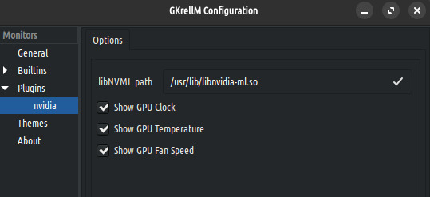

A simple [GKrellM](http://gkrellm.srcbox.net/) plugin for reading nvidia GPUs data.
Clock, Temperature and Fan Speed for multiple GPU are supported.

~~XNVCtrl library *is required*~~
[NVML](https://developer.nvidia.com/nvidia-management-library-nvml) library *is required*

