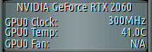
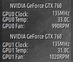

# gkrellm-nvidia  

A simple [GKrellM](http://gkrellm.srcbox.net/) plugin for reading nvidia GPUs data.
Clock, Temperature and Fan Speed for multiple GPU are supported.

XNVCtrl library *is required*

